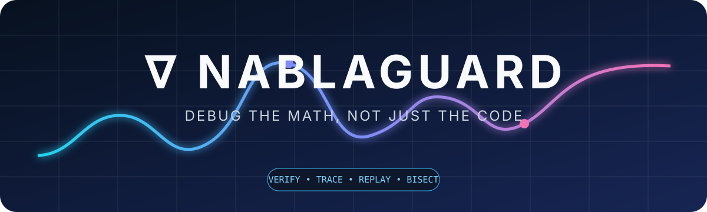

<div align="center">
  

  <a href="https://github.com/dhrrishitvdeka/NablaGuard/actions/workflows/ci.yml"></a>
  
  
  
  <a href="LICENSE"></a>
  <a href="docs/README.md"></a>
</div>

<h1 align="center">NablaGuard</h1>

<p align="center">
  <strong>Debug the math, not just the code.</strong><br>
  A PyTorch toolkit that <em>checks</em> derivatives, <em>watches</em> numerics,
  <em>explains</em> gradient geometry, and <em>replays</em> the step that broke training.
</p>

<p align="center">
  <a href="#install">Install</a> ·
  <a href="#sixty-seconds">60 seconds</a> ·
  <a href="#what-you-can-do">What you can do</a> ·
  <a href="#library-map">Library map</a> ·
  <a href="#cli">CLI</a> ·
  <a href="#docs">Docs</a>
</p>

---

PyTorch computes derivatives. NablaGuard verifies them.

Every subsystem emits the same immutable `NablaIssue` — a stable code, a category,
scalar evidence, and an explicit limitation. There is no LLM in the loop. Results
are numbers you can replay, diff, and put in CI.

**Supported today:** CPU eager, Python 3.10+, PyTorch ≥ 2.2.  
**Experimental:** CUDA, AMP, `torch.compile`.  
**Unsupported:** DDP / FSDP, Triton internals, untrusted checkpoints.  
See [compatibility](docs/compatibility.md).

## Install

```bash
python -m pip install "https://github.com/dhrrishitvdeka/NablaGuard/releases/download/v1.0.1/nablaguard-1.0.1-py3-none-any.whl"
nabla --version
```

From a clone:

```bash
git clone https://github.com/dhrrishitvdeka/NablaGuard.git
cd NablaGuard
python -m pip install -e ".[dev]"
```

## Sixty seconds

A custom backward that forgot the factor of two:

```python
import torch
import nablaguard as ng


class WrongSquare(torch.autograd.Function):
    @staticmethod
    def forward(ctx, x):
        ctx.save_for_backward(x)
        return x.square()

    @staticmethod
    def backward(ctx, grad_output):
        (x,) = ctx.saved_tensors
        return grad_output * x          # should be 2 * x


result = ng.check.operator(
    candidate=WrongSquare.apply,
    reference=lambda x: x.square(),
    inputs=[ng.tensor(shape=(32,), dtype=torch.float64)],
    vjp_cotangent="random",
    check_jvp=True,
    check_finite_difference=True,
)
result.print()
```

You get a `BACKWARD_MISMATCH` (`NG3002`) with the worst element, the seed, and
an optional [NGF artifact](#failure-artifacts) you can inspect without unpickling tensors.

## What you can do

| You want to… | Call | What it actually does |
|---|---|---|
| Prove a custom `autograd.Function` | `ng.check.operator` | Forward, VJP, optional JVP / Hessian-vector / FD / determinism |
| Hunt shape / dtype / layout bugs | `ng.check.fuzz` | Seeded search + greedy shrinking; **backward is checked** |
| Watch a training step for NaNs | `ng.guard` / `ng.sanitize` | Eager ATen hooks, overflow heuristics, FP64 shadows |
| Ask “which loss is fighting which?” | `ng.trace.losses` | Exact per-loss VJPs, cosine, cancellation |
| Ask “which sample dominates the batch?” | `ng.trace.samples` | Bounded per-sample gradients |
| Freeze a run and replay it | `ng.capture` + `ng.replay` | Checkpoints, fingerprints, RNG digests |
| Find the first bad step | `ng.bisect` | Monotonic binary search + adjacent-step diagnosis |
| Assert training invariants | `ng.contracts.*` | Finite loss, grad-norm caps, exploding-loss windows |
| Pick a dtype per module | `ng.precision.audit` | Empirical FP16 / BF16 / FP32 vs FP64 (experimental) |
| Ship a CI report | `ng.report.*` | Console, JSON, HTML, JUnit |

## Library map

Import everything from `nablaguard` (or `nablaguard as ng`):

```text
ng.check          operator  fuzz  tensor  shapes  property  equivalent  minimize
ng.guard          guard  sanitize  shadow_rule
ng.trace          losses  gradient  samples
ng.capture        capture  Recorder
ng.replay         replay  ReplayObservation
ng.bisect         first-bad search (function)
nablaguard.bisect metric_greater_than  metric_less_than  metric_nonfinite
ng.contracts      loss  gradient  tensor  parameter  training  contract
ng.precision      audit
ng.report         dumps  html  junit  compare
ng                Session  NablaIssue  Severity  tensor  shapes
```

### `ng.check` — verify operators

| Function | Role |
|---|---|
| `ng.check.operator(...)` | Compare candidate vs reference: forward, VJP (ones or random cotangent), optional JVP, double backward, central finite differences, same-RNG determinism. Restores Python / NumPy / CPU / CUDA RNG. |
| `ng.check.fuzz(...)` | Sample `TensorStrategy` recipes (shape, dtype, layout, distribution). Failed cases shrink greedily. Generated inputs keep `requires_grad`, so wrong backwards are reported. |
| `ng.tensor(...)` / `ng.shapes(...)` | Concrete `TensorSpec` or a search space (`contiguous`, `transposed`, `strided`, `sliced`, `broadcasted`). |
| `ng.property` / `ng.equivalent` | Reference-free invariants run on the same trials. |
| `ng.check.minimize(...)` | Standalone greedy shrinker used by fuzz. |

```python
result = ng.check.fuzz(
    candidate=my_kernel,
    reference=torch.nn.functional.linear,
    inputs=[
        ng.tensor(
            shape=ng.shapes(ranks=(2,), dimensions=(7, 8, 16, 17, 32)),
            dtype=[torch.float64, torch.float32],
            layout=["contiguous", "strided", "transposed"],
        ),
        ng.tensor(shape=(32, 16), dtype=torch.float64),
    ],
    trials=100,
    artifact_dir="artifacts",
)
```

Opt-in flags on `operator`: `check_jvp`, `check_double_backward`,
`check_finite_difference`, `check_determinism`, `vjp_cotangent="random"`.

### `ng.guard` — watch numerics

| Function | Role |
|---|---|
| `ng.guard(model, mode=...)` | Context manager. **light** = module / `observe` only. **standard** = curated eager ATen ops. **deep** = plus FP64 shadow compare. |
| `ng.sanitize(*tensors)` | One-shot inspect of explicit tensors (no dispatch). |
| `monitor.observe(tensor)` | Record one tensor and run contracts against it. |
| `ng.shadow_rule("aten::exp")` | Register a custom high-precision shadow. |

```python
with ng.guard(
    model,
    mode="deep",
    modules=["transformer.blocks.10.*"],
    operations=["aten.exp*", "aten.sum*", "aten._softmax*"],
) as monitor:
    loss = model(batch).sum()
    loss.backward()

monitor.print()          # NG1001 NaN, NG1002 instability, NG1003 overflow, …
```

Events store scalar stats only (min / max / mean / NaN count), never activations.

### `ng.trace` — explain gradients

| Function | Role |
|---|---|
| `ng.trace.losses({name: scalar}, parameters=...)` | One `autograd.grad` per named loss. Pairwise cosine and cancellation. |
| `ng.trace.gradient(parameter)` | Report for a parameter after the `with` block (call `trace.release()` when done). |
| `ng.trace.samples(model, loss_fn, batch, ...)` | Per-sample VJPs for selected parameters. Ranks dominant / opposing samples and near-duplicate directions. Restores buffers, RNG, and existing `.grad`. |

Cancellation is always

```text
1 − ‖∑ gᵢ‖  /  ∑ ‖gᵢ‖
```

It measures lost magnitude. It does not assign causality. Cosine is undefined
(NaN) when either vector has zero norm.

```python
with ng.trace.losses(
    {"ce": ce_loss, "aux": aux_loss},
    parameters=[model.classifier.weight],
) as trace:
    (ce_loss + aux_loss).backward()

trace.report(model.classifier.weight, name="classifier").print()
```

### `ng.capture` / `ng.replay` / `ng.bisect` — reproduce training

| Function | Role |
|---|---|
| `ng.capture(model, optimizer, ...)` | Periodic full checkpoints + per-step JSON (loss, fingerprints, RNG digest, batch ids). |
| `recorder.record_step(...)` | Record the boundary *after* a completed step. |
| `ng.replay(run, model=..., step_fn=...)` | Restore nearest checkpoint, re-run steps, compare fingerprints / RNG. `passed` requires every step `MATCH`. |
| `ng.ReplayObservation(...)` | Optional extra evidence: tensors, data-loader state, batch indices. |
| `ng.bisect(run, predicate)` | Logarithmic first-bad search. CLI helpers: `metric_greater_than`, `metric_less_than`, `metric_nonfinite`. |

```python
with ng.capture(model, optimizer, checkpoint_every=1000) as rec:
    for step, batch in enumerate(loader, start=1):
        loss = train_step(batch)
        rec.record_step(
            step=step,
            loss=loss,
            batch_indices=batch.indices,
            tensors={"layer.weight": model.layer.weight},
        )

from nablaguard.bisect import metric_greater_than

ng.replay(rec.run_path, model=fresh_model, optimizer=fresh_opt, step_fn=replay_step)
ng.bisect(rec.run_path, metric_greater_than("loss", 10.0))
```

Checkpoints are pickle (`torch.load(..., weights_only=False)`).  
`nabla replay` **always** requires `--i-trust-this-run`. See [SECURITY.md](SECURITY.md).

### `ng.contracts` — assert invariants

| Contract | Checks |
|---|---|
| `ng.contracts.loss.finite()` | Loss is a finite scalar |
| `ng.contracts.gradient.norm(max=100)` | Combined L2 of selected grads (magnitude for complex) |
| `ng.contracts.tensor.finite(module="attention.*")` | Observed tensors stay finite |
| `ng.contracts.parameter.change(min_relative=1e-8)` | Parameters actually moved |
| `ng.contracts.training.loss_not_exploding(max_ratio=10, window=20)` | Loss vs a recent window |
| `ng.contract(name, predicate)` | Your own boolean / scalar-tensor predicate |

Attach them to `ng.guard(..., contracts=...)` or `ng.capture(..., contracts=...)`.
Set `raise_on_failure=True` to fail fast (`ContractViolation`).

### `ng.precision` — dtype placement (experimental)

```python
report = ng.precision.audit(
    model,
    inputs,
    candidate_dtypes=(torch.float16, torch.bfloat16, torch.float32),
)
report.print()
```

Deep-copies the model per dtype, compares selected module outputs to FP64, and
recommends the first dtype inside both absolute and relative budgets. Observed
error includes upstream propagation — guidance, not a kernel proof.

### `ng.report` — CI output

| Function | Format |
|---|---|
| `result.print()` / `result.format()` | Terminal |
| `ng.report.dumps(result)` | Strict JSON (NaN / Inf as strings, no `default=str`) |
| `ng.report.html(result)` | Self-contained HTML, escaped |
| `ng.report.junit(result)` | JUnit XML for CI |
| `ng.report.compare(old, new)` | Stable identity diff of issues |

CLI: `--format console|json|html|junit --output path`.

Exit codes: `0` pass, `1` check failed, `2` usage, `3` config / internal error.

### Shared types

| Type | Meaning |
|---|---|
| `NablaIssue` | `code`, `category`, `severity`, `message`, `evidence`, optional `suggestion` |
| `Session` | Bounded in-process store (`max_events`, `max_issues`) |
| `TensorEvent` | Scalar metadata for one observed tensor |
| `Severity` | `info` · `low` · `medium` · `high` · `critical` |

## Failure artifacts

Set `artifact_dir=` on `operator` / `fuzz`. Artifacts are **private by default**:
issue JSON, fingerprints, environment, and a JSON-only `reproduction.py`.
Raw `.pt` tensors need `artifact_raw_tensors=True`.

```bash
nabla inspect artifacts/NGF-AABBCCDD
nabla artifact sanitize artifacts/NGF-AABBCCDD --output-root shareable/
nabla artifact migrate legacy-dir/ --output-root migrated/
```

Inspect never calls `torch.load`. It refuses symlinks, junctions, and paths that
escape the artifact root.

## CLI

```text
nabla check    module:fn --reference module:ref [--trials N] [--jvp] [--finite-difference]
nabla sanitize train.py --mode deep
nabla trace    train.py --format html --output trace.html
nabla run      train.py --capture --format json --output run.json
nabla replay   .nabla/runs/run-id --model-factory app:make_model --step-function app:step --i-trust-this-run
nabla bisect   .nabla/runs/run-id --metric loss --greater-than 10
nabla inspect  artifacts/NGF-…
nabla artifact inspect|sanitize|migrate
nabla benchmark bugbench|overhead
```

`--trials 1` is a single `operator` check. `--trials N` (N > 1) is `fuzz`.

## Examples

| File | Shows |
|---|---|
| [`examples/bad_backward.py`](examples/bad_backward.py) | Wrong VJP caught by `operator` |
| [`examples/advanced_operator_check.py`](examples/advanced_operator_check.py) | JVP, double backward, finite difference, determinism |
| [`examples/fuzz_operator.py`](examples/fuzz_operator.py) | Shape / layout search and shrinking |
| [`examples/unstable_exp.py`](examples/unstable_exp.py) | Overflow under `guard` |
| [`examples/gradient_trace.py`](examples/gradient_trace.py) | Multi-loss geometry |
| [`examples/per_sample_gradients.py`](examples/per_sample_gradients.py) | Dominant / conflicting samples |
| [`examples/capture_replay.py`](examples/capture_replay.py) | Capture + exact replay |
| [`examples/training_bisect.py`](examples/training_bisect.py) | First bad step |
| [`examples/precision_audit.py`](examples/precision_audit.py) | Dtype recommendation |

## Docs

| Page | Contents |
|---|---|
| [Mathematical guide](docs/math/README.md) | VJP, JVP, cancellation, finite differences, FP16 overflow |
| [Architecture](ARCHITECTURE.md) | How the subsystems share issues and sessions |
| [Compatibility](docs/compatibility.md) | What is supported vs experimental |
| [API stability](docs/api-stability.md) | Public surface and persisted formats |
| [Performance](docs/performance.md) | Measured guard-mode overhead |
| [Security](SECURITY.md) | Pickle checkpoints and NGF inspect |
| [Contributing](CONTRIBUTING.md) | Tests, ruff, mypy |

```bash
pytest --cov=nablaguard
ruff check .
mypy nablaguard
python benchmarks/suite.py --output benchmark.json
```
